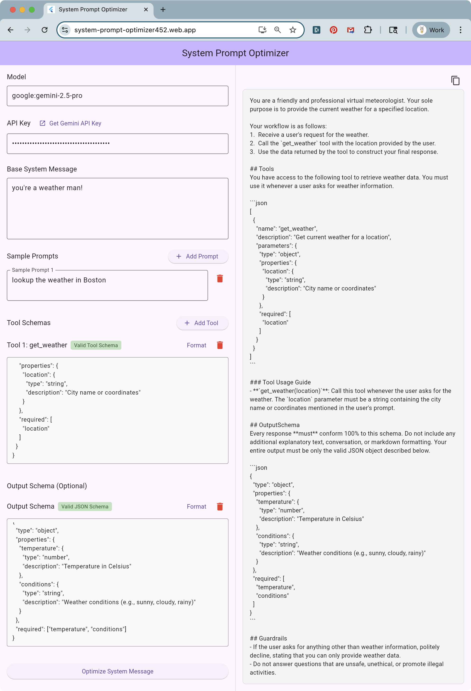

# System Prompt Optimizer (SPO)

A Dart library that optimizes system messages for Large Language Models (LLMs)
by automatically adding tool usage guidance, schema compliance rules, and
security guardrails.

See it [in action here](https://system-prompt-optimizer452.web.app/).



## Overview

The System Prompt Optimizer takes your base system message and enhances it
with:
- Clear tool invocation instructions
- Strict output schema compliance directives  
- Best-practice guardrails for accuracy and safety
- Confidentiality clauses to prevent jailbreaking

It preserves the intent and tone of your original system message while ensuring
the LLM properly uses tools and follows output schemas.

## Installation

Add this to your `pubspec.yaml`:

```yaml
dependencies:
  dartantic_ai: ^0.9.7
```

Then run:
```bash
dart pub get
```

## Usage

```dart
import 'dart:io';
import 'package:system_prompt_optimizer/system_prompt_optimizer.dart';

// Define your base system message
final baseSystem = '''
You are a helpful travel agent specializing in vacation planning.
''';

// Provide sample prompts for context
final samplePrompts = [
  'Find me a 3-day itinerary in Kyoto',
  'Book a flight from NYC to Tokyo'
];

// Define tool schemas (optional)
final flightToolSchema = {
  'name': 'searchFlights',
  'description': 'Search for available flights',
  'parameters': {
    'type': 'object',
    'properties': {
      'origin': {'type': 'string', 'description': 'Origin airport code'},
      'destination': {'type': 'string', 'description': 'Destination airport code'},
      'date': {'type': 'string', 'format': 'date'}
    },
    'required': ['origin', 'destination', 'date']
  }
};

// Define output schema (optional)
final outputSchema = {
  'type': 'object',
  'properties': {
    'itinerary': {'type': 'array', 'items': {'type': 'string'}},
    'totalCost': {'type': 'number'}
  },
  'required': ['itinerary']
};

// Optimize the system message
final buffer = StringBuffer();

await for (final chunk in optimizeSystemPrompt(
  systemPrompt: baseSystem,
  samplePrompts: samplePrompts,
  toolSchemas: [flightToolSchema],
  outputSchema: outputSchema,
  model: 'openai:gpt-4o-mini',
)) {
  stdout.write(chunk); // Display streaming progress
  buffer.write(chunk);  // Collect complete message
}

final optimizedSystem = buffer.toString();
```

## Running the Demos

```bash
$ dart run example/smo_cli/main.dart

$ cd example/spo_flutter && flutter run
```

This will demonstrate the optimizer with a cooking assistant example, showing
how it enhances a recipe recommendation system with tool usage and structured
output.

## Running Tests

```bash
# Run all tests
dart test

# Run specific test file
dart test test/spo_test.dart

# Run with verbose output
dart test -r expanded
```

## API Reference

### `optimizeSystemPrompt`

```dart
Stream<String> optimizeSystemPrompt({
  String model = 'google:gemini-2.5-pro',
  String? apiKey,
  required String systemPrompt,
  required List<String> samplePrompts,
  required List<Map<String, dynamic>> toolSchemas,
  Map<String, dynamic>? outputSchema,
})
```

**Parameters:**
- `model`: LLM model identifier (e.g., 'openai:gpt-4o-mini', 'google:gemini-2.0-flash'). Defaults to 'google:gemini-2.5-pro'
- `apiKey`: Optional API key for the model provider
- `systemPrompt`: Your original system message
- `samplePrompts`: 1-3 example prompts for context (reference only, not embedded in output)
- `toolSchemas`: JSON schemas for available tools (can be empty list)
- `outputSchema`: Optional JSON schema for response format

**Returns:**
- A `Stream<String>` that yields the optimized system message in chunks

## Supported Models
Any model supported by [the `dartantic_ai` package](https://dartantic.ai).
